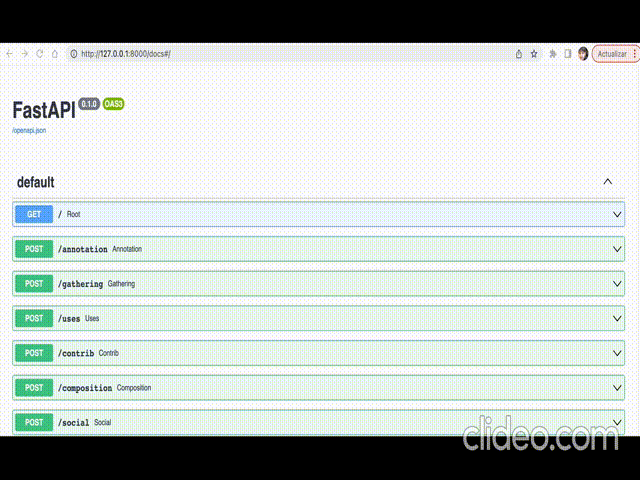

# DataDoc Analyzer


Extract, in a structured manner, the **[general guidelines](https://knowingmachines.org/reading-list#dataset_documentation_practices)** from the ML community about dataset documentation practices from its scientific documentation. Study and analyze scientific data published in peer-review journals such as: **[Nature's Scientific Data](https://www.nature.com/sdata/)** and **[Data-in-Brief](https://www.data-in-brief.com)**. 

Here you have a **[complete list](https://zenodo.org/record/7082126#.ZDaf-OxBz0p)** of data journals suitable to be analyzed with this tool. Test the web UI of the tool in the following **[HuggingFace Space](https://huggingface.co/spaces/JoanGiner/DataDoc_Analyzer)**, and the API using our **[Docker image](https://hub.docker.com/r/joangi/datadoc_analyzer)**


## ⚒️ Installation

The tools come with two UIs. A web app built with Gradio intended to test the tool's capabilities and analyze a single document (you can try it in the **[HuggingFace Space](https://huggingface.co/spaces/JoanGiner/DataDoc_Analyzer)**). And a API built with FastAPI, suited to be integrated into any ML pipeline:


To use this tool, you need to have **python3.10**, **git**, and **pip** installed in your system. Then just:


```
git clone https://github.com/SOM-Research/DataDoc-Analyzer.git datadoc

## Enter to the created folder
cd datadoc

## Install dependencies (Better to do this in a virtual enviroment)
pip install -r requirements.txt
```
##### Run the web UI:
```
python3 app.py
```
##### Run the API:
```
uvicorn api:app 
```
##### Run the API using the docker image:

First you need to install **docker** in your sistem. Then:

```
docker pull joangi/datadoc_analyzer
docker run --name apidataset -p 80:80 joangi/datadoc_analyzer
docker exec apidataset apt -y install default-jre 
```

The API will be running in your localhost at port 80. (You can change the port in the command above)


## ☑️ Usage

### Web UI

To use this tool, you need to provide your own API key from OpenAI (Not needed during the review process). 

Once set, you can upload your PDF from one of the scientific journals suited for this tool[^1]. Keep in mind that we analyze “data papers.” Other journal publications, such as “meta-analysis” or full papers, may not work adequately.

At last, click on “get insights” of any tab, and you will get the results together with the completeness report.


[^1]: Some journals that publish data papers:
 **[Nature's Scientific Data](https://www.nature.com/sdata/)**, **[Data-in-Brief](https://www.data-in-brief.com)**, **[Geoscience Data Journal](https://rmets.onlinelibrary.wiley.com/journal/20496060)** etc... Here you have a **[complete list](https://zenodo.org/record/7082126#.ZDaf-OxBz0p)** of data journals suitable to be analyzed with this tool.

 <div align="center" style="width:100%">


</div>

 ### API

 The API imitates the behavior of the tabs of the web UI, but, in addition, you also have an endpoint to retrieve all the dimensions at the same time. The API's swagger documentation, which can be tested in situ, is published together along the API. The server will start at port 8000 by default (if not occupied by another app of your system). And the documentation will be found at http://127.0.0.1:8000/docs


<div align="center" style="width:100%">




</div>

## 📚 Background research

The tool will be presented at the [32nd ACM International Conference on Information and Knowledge Management](https://uobevents.eventsair.com/cikm2023/) in October '23. Preprint of the publication soon. Meanwhile, check this [short video presenting the tool](https://www.youtube.com/watch?v=bffVXA5D2-8)


## ⚖️ License

This work is licensed under a <a rel="license" href="http://creativecommons.org/licenses/by-sa/4.0/">Creative Commons Attribution-ShareAlike 4.0 International License</a>

The [CC BY-SA](https://creativecommons.org/licenses/by-sa/4.0/) license allows reusers to distribute, remix, adapt, and build upon the material in any medium or format, so long as attribution is given to the creator. The license allows for commercial use. If you remix, adapt, or build upon the material, you must license the modified material under identical terms.

<a rel="license" href="http://creativecommons.org/licenses/by-sa/4.0/"></a>


